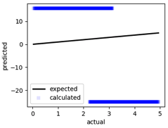
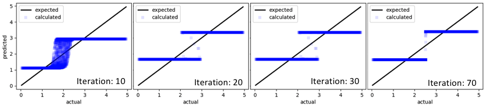
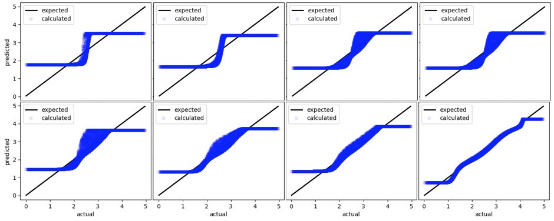
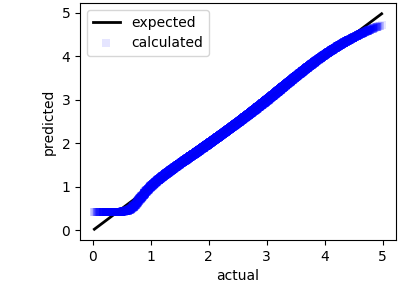

# Evolutionary algorithms for deep learning

In recent times, there has been tremendous progress in deep learning. I certainly do not need to provide a litany of recent events wherein deep learning has taken the world by storm. If you are reading this out of interest, I would very likely be preaching to the choir. Let us then delve directly into the matter at hand. 

Let us look at ways of implementing evolutionary strategies to augment deep learning. This will be part of a series of posts that will explore ways of incorporating evolutionary stratigies into deep learning architectures.

We do not wish to end these posts in academic affairs. We wish to look into realistic implementations that everyone can tinker with. We shall generate a (relatively simple) deep learning architecture in [TensorFlow](https://www.tensorflow.org), and optimize them using selected evolutionary strategies. 

## 1. What are we Solving?

So what problem are we looking at specifically?

### 1.1. The Mathematical Representation of a Neural Network 

Neural networks approximate functions. Like the ones you have already encountered in math: \\(  f( \mathbf x ) = \mathbf y \\). \\( \mathbf x \\)  goes into the function \\( f() \\), and out comes \\( \mathbf y \\). Both \\(\mathbf x \\) and \\(\mathbf y\\) can be anything. Scalars, vectors, complex vectors, tensors, binary digits, and what have you. \\(\mathbf y\\) may similarly be eqaually varied. 

For the purposes of this and subsequent articles, we shall assume that both \\(\mathbf x\\) and \\(\mathbf y\\) are real valued vectors, not necessarily of the same dimensions. 

Neural networks *approximate* the function \\( f(  \mathbf x) \\) by using \\(N\\) internal parameters called weights (and sometimes biases. For simplicity, we shall refer to the collection of weights and biases as weights for the rest of the article). We shall represent them with \\( \mathbf W = [\mathbf w_0, \mathbf w_1, \ldots \mathbf w_{N-1} ]  \\). Practically, all forms of neural networks are represented by these weights and their corresponding *connections* (here, I use the word connections loosely). Connections and weights together form the architecture. 

If we represent the neural network with the function 

$$ f_{ \mathbf {W} } ( \mathbf  x) $$

We want to find optimal weights \\(  \mathbf {W_{Opt}}  \\) such that

$$ f_{ \mathbf {W_{Opt}} } ( \mathbf  x) \approx f ( \mathbf  x)  = \mathbf y $$

for all \\( \mathbf x \\).

### 1.2. Learning

Learning is the process of finding a good set of weights \\(  \mathbf {W_{Opt}} \\). Typical ways of doing this is by some form of gradient descent. Typical algorithms used are the [Steepest Descent](http://mathworld.wolfram.com/MethodofSteepestDescent.html), [Adagrad](https://cs.stanford.edu/~ppasupat/a9online/1107.html), [RMSprop](https://www.coursera.org/learn/deep-neural-network/lecture/BhJlm/rmsprop), and [Adam](https://arxiv.org/abs/1412.6980). 

## 2. The Why ?

There are several problems associated with gradient-based approaches, especially when the optimization dimensionality increases. 

1. The error function *must* be differentiable
2. The error surface *must* be convex (and relatively noiseless)
3. The path toward descent is one along a local minima

Some of these problems can be averted using other non-gradient techniques. These include forms of Evolutionary Algorithms (such as [Genetic Algorithms](https://en.wikipedia.org/wiki/Genetic_algorithm), [Differential Evolution](https://en.wikipedia.org/wiki/Differential_evolution), etc.), or methods such as [Particle Swarm Optimization](https://en.wikipedia.org/wiki/Particle_swarm_optimization) or  [Simulated Annealing](https://en.wikipedia.org/wiki/Simulated_annealing). 

In this article we shall look at one particular algorithm - Genetic Algorithms for the optimization process. In a later article, we shall look at how both the Genetic Algorithm and the a Adam can work together to produce better results. 

## 3. The How ... Show me the code already !!!

The code is available in the repo: [NNoptExpt](https://github.com/sankhaMukherjee/NNoptExpt). Constructive criticism is always welcome.

Note that although the code shown below is written using the TensorFlow library, this framework can easily be used for any type of class used.   The code shown below is significantly simplified and all error checking, docstrings, logging removed so that it is much easier to follow.

### 3.1. A Generic Neural Network Class

So lets create a simple neural network class [full code here](https://github.com/sankhaMukherjee/NNoptExpt/blob/master/src/lib/NNlib/NNmodel.py).  This is relatively simple code. The neural network that we have created is a simple sequential model. The input to this is simply the input (`inpSize`) and  output (`opSize`) sizes, the number of neurons in each layer (`layers`) passed in as a list, and their corresponding activations (`activations`). Each activation is one of the allowed TensorFlow [activations](https://www.tensorflow.org/api_guides/python/nn#Activation_Functions), or `None` in which case, no activation is applied.

```python
class NNmodel(): 
    
    def __init__(self, inpSize, opSize, layers, activations):

        self.fitted = False
        self.currentErrors = None

        self.Inp     = tf.placeholder(dtype=tf.float32, shape=inpSize, name='Inp')
        self.Op      = tf.placeholder(dtype=tf.float32, shape=opSize, name='Op')
        
        self.allW, self.allWPH, self.allAssignW = [], [], []
        self.allB, self.allBPH, self.allAssignB = [], [], []

        self.result  = None

        prevSize = inpSize[0]
        for i, l in enumerate(layers):

            tempW       = tf.Variable( 0.1*(np.random.rand(l, prevSize) - 0.5), dtype=tf.float32, name='W_{}'.format(i) )
            tempWPH     = tf.placeholder(dtype=tf.float32, shape=(l, prevSize), name='PHW_{}'.format(i))
            tempAssignW = tf.assign(tempW, tempWPH, name='AssignW_{}'.format(i))

            tempB       = tf.Variable( 0, dtype=tf.float32, name='B_{}'.format(i) )
            tempBPH     = tf.placeholder(dtype=tf.float32, shape=tuple(), name='PHB_{}'.format(i))
            tempAssignB = tf.assign(tempB, tempBPH, name='AssignB_{}'.format(i))

            self.allW.append( tempW )
            self.allWPH.append( tempWPH )
            self.allAssignW.append( tempAssignW )

            self.allB.append( tempB )
            self.allBPH.append( tempBPH )
            self.allAssignB.append( tempAssignB )

            if i == 0:
                self.result = tf.matmul( tempW, self.Inp ) + tempB
            else:
                self.result = tf.matmul( tempW, self.result ) + tempB

            prevSize = l

            if activations[i] is not None:
                self.result = activations[i]( self.result )

        self.err = tf.sqrt(tf.reduce_mean((self.Op - self.result)**2))
        self.init = tf.global_variables_initializer()

        return
        
    # more code here
```

#### 3.1.1. Special Aside: Inserting external values into the weights

If you want to insert values into a TensorFlow `Variable`, you will need to use the [`tf.assign`](https://www.tensorflow.org/api_docs/python/tf/assign) operation. This, like all other TensorFlow operation will *extend* the tensor graph every time it is called within a session. Hence, we need to generate a separate `tf.assign` operator for *every* weight we want to be able to change within the graph, and associate a placeholder for *each of these assign operations*. This is what you see in lines 23, 24, 27, 28 of the code. 

Similarly, you only want a single `tf.global_variables_initializer()` operation. We save this within the initializer as well. 

#### 3.1.2. Other Helper Methods

Let us generate a set of helper classes that will be instrumental in making this amenable for optimization using evolutionary techniques.

##### 3.1.2.1. Getting and Setting Weights

These functions will allow us to get the current weights, and set the weights of the neural network. These functions, when implemented, will allow other algorithms to change the weights of the network within a TensorFlow session. The other algorithms no longer need to remember the details of the neural network. This will allow for arbitrarily complex neural networks to be optimized. 

```python
def getWeights(self, sess=None):
    weights = None
    if sess is not None:
        weights = sess.run( self.allW + self.allB  )
        return weights

    with tf.Session() as sess:
        sess.run(self.init)
        weights = sess.run( self.allW + self.allB )
        return weights

def setWeights(self, weights, sess):
    Nw = len(self.allW)
    Ws = weights[:Nw]
    Bs = weights[Nw:]

    for i, (w, mW) in enumerate(zip(Ws, self.allAssignW)):
        sess.run(mW, feed_dict={ 'PHW_{}:0'.format(i) : w } )

    for i, (b, mB) in enumerate(zip(Bs, self.allAssignB)):
        sess.run(mB, feed_dict={ 'PHB_{}:0'.format(i) : b } )
```

##### 3.1.2.2. Calculating Errors and Making Predictions

Getting error values and making predictions. Again, these are self-explanatory. This reduces the burden on the optimizer in knowing about the details of the neural network. The last convenience functions is not necessary, but good to have. Given a set of weights, this will return all errors associated with them. Its utility will become quickly apparent when we generate populations of weights.

```python
def errorValW(self, X, y, weights):
    with tf.Session() as sess:
        sess.run(self.init)
        self.setWeights(weights, sess)
        errVal = sess.run(self.err, feed_dict = {self.Inp: X, self.Op: y})

    return errVal

def predict(self, X, weights):
    with tf.Session() as sess:
        sess.run(self.init)
        self.setWeights(weights, sess)
        yHat = sess.run(self.result, feed_dict = {self.Inp: X})

    return yHat
    
def errorValWs(self, X, y, weightsList):
        errVals = []
        with tf.Session() as sess:
            sess.run(self.init)
            for weights in weightsList:
                self.setWeights(weights, sess)
                errVal = sess.run(self.err, feed_dict = {self.Inp: X, self.Op: y})
                errVals.append(errVal)

        return errVals
```


### 3.2. Initialization Example

How do we initialize this? The code below should be sufficient as an explanation. 

 - The input is 2-dimensional
 - There are 2 hidden units (with 5 and 8 neurons respectively), and 
 - The output is single dimensional. 
 - Activations for the two hidden layers are `tf.tanh`, while the last layer isn't activated (useful for regression problems). 

```python
inpSize     = (2, None)
opSize      = (1, None)
layers      = (5, 8, 1)
activations = [tf.tanh, tf.tanh, None]
model1      = NNmodel(inpSize, opSize, layers, activations)
```

### 3.3. Using this NN class

Now we can quickly check whether the weights may be properly transferred across multiple sessions. Weights of the NN are obtained in one session, 5 added to the original weights, and these values inserted into the NN in a new session. As can be seen, the new session contain brand new weights.  

```python
with tf.Session() as sess:
    sess.run(model1.init)
    weights = model1.getWeights()
    print(weights)
    weights = [w+5 for w in weights]
    
with tf.Session() as sess:
    sess.run(model1.init)
    model1.setWeights(weights, sess)
    weights1 = model1.getWeights(sess)
    
print(weights1)
```
### 3.4. The GA Class

A GA class (original code [here](https://github.com/sankhaMukherjee/NNoptExpt/blob/master/src/lib/GAlib/GAlib.py)) is generated that can be used for optimizing a NN. It takes a particular NN class `nnClass` and its corresponding initialization parameters (`initParams`). An internal NN instance is created (`tempN`).

Using this NN, the set of weights is generated that will span the optimization space of the weights. Imagine a population of weights. 

$$ \mathbf P = [ \mathbf W_1, \mathbf W_2, \ldots \mathbf W_{N_{pop}}] $$

We want the algorithm to evolve such that the weights slowly, over several generations, evolve toward \\( \mathbf {W_{Opt}} \\).

For this simple example, to each weight, a random number is added, changing the weight to a certain amount. This generates a randomized population to begin. 

```python
class GA():

    def __init__(self, nnClass, initParams):
        self.properConfig = False
        self.currentErr   = None
        self.GAconfig     = json.load( open('../config/GAconfig.json') )
        self.population   = []
        self.tempN        = nnClass(**initParams) # Use this for temp storage
        temp = self.tempN.getWeights()
        for i in tqdm(range(self.GAconfig['numChildren'])):
            self.population.append( [ t + self.GAconfig['initMultiplier']*(np.random.rand()-0.5)  for t in temp] )
        
        self.properConfig = True

        return
    # more methods here ...
```

#### 3.4.1. GA overview

> **Note**: There are many ways of doing each of these operations. There is no "right" way of doing GA. Certain methods may be better than others for certain situations. In what follows, we shall keep the methodology to the absolute simplest that is possible.

Here, we shall look briefly at the overview of the algorithm. This is an iterative algorithm. At each iteration, the algorithm does two things:

 - mutation: Where the algorithm giggles weights by a bit with the hope that it will get better by chance
 - crossover (and selection): gets two of the better weights and generates a weight that is a linear combination of the two. 

Both these will be discussed in greater detail in subsequent sections. 

```python
    def fit(self, X, y, folder=None, verbose=True):
        self.err(X, y)
        for i in range(self.GAconfig['numIterations']):
            self.mutate()
            self.crossover(X, y)
```

The errors are calculated for the entire population to begin with so that the calculations for subsequent calculations is reduced. 

#### 3.4.2. Error Calculations
The calculation of errors for the population of weights simply involves the calculation of errors corresponding to each set of weights within the populaiton.

```python
def err(self, X, y):
        if self.properConfig:
            self.currentErr = self.tempN.errorValWs(X, y, self.population) 
        return self.currentErr
```

#### 3.4.3. Mutation

As we have mentioned before, mutation giggles weights about their current values. In this particularly naive version, it perturbs all weights other than a few of the best. Not touching a few of the best weights is called elitism which makes sure that the best of the population always remain through every iteration. 

```python
def mutate(self):
        sortIndex = np.argsort( self.currentErr )
        self.population = [ self.population[i]  for i in sortIndex ]
        self.currentErr = [ self.currentErr[i]  for i in sortIndex ]

        for i in range(len(self.population)):
            if self.GAconfig['elitism']['toDo'] and (i < self.GAconfig['elitism']['numElite']):
                continue
            
            newWeights = []
            for w in self.population[i]:
                t = w*( 1 + 2*self.GAconfig['mutation']['multiplier']*(np.random.random(w.shape) - 0.5) )
                newWeights.append( t )

            self.population[i] = newWeights
```

#### 3.4.4. Crossover and Selection

Crossover determines how a new population is generated, given the previous population. A new set of weights ($\mathbf {W_{child, m}} $) at the \\(m\\)th poistion of the next population is generated from a couple of weights ($\mathbf {W_i} $ and $\mathbf {W_j} $) from the previous generation. $\mathbf {W_i} $ and $\mathbf {W_j} $ are randomly choses, but the probabilities are weighed based upon their errors. Weights that have lower errors are favored. 

Crossover may be represented as:

$$ \mathbf {W_{child,m}} =   \alpha \mathbf {W_i} + (1-\alpha) \mathbf {W_j} $$ 

Here, \\( \alpha \\) is randomly chosen between 0 and 1. 

Selection represents which weights will make it to the next generation. If the error resulting from \\( \mathbf {W_{child,m}} \\) is less than \\( \mathbf {W_m} \\) then the new weight is selected. Otherwise the old weight is retained. 

```python
    def crossover(self, X, y):

        sortIndex = np.argsort( self.currentErr )
        self.populationOld = [ self.population[i]  for i in sortIndex ]
        self.population    = [ self.population[i]  for i in sortIndex ]
        
        self.currentErrOld = [ self.currentErr[i]  for i in sortIndex ]
        self.currentErr    = [ self.currentErr[i]  for i in sortIndex ]
        
        normalize = np.array(self.currentErr).copy()
        normalize = normalize / normalize.max()
        normalize = 1 - normalize
        normalize = normalize / normalize.sum()

        choices = np.random.choice( range(len(self.currentErr)), size=(len(self.population), 2) , p=normalize )
        alphas  = np.random.random( len(self.currentErr) )

        for i in range(len(self.population)):
            if self.GAconfig['elitism']['toDo'] and (i < self.GAconfig['elitism']['numElite']):
                continue

            c1, c2 = choices[i]
            a = alphas[i]

            w1 = self.populationOld[c1]
            w2 = self.populationOld[c2]
            wNew = [ a*m + (1-a)*n  for m, n in zip( w1, w2 ) ]

            errVal = self.tempN.errorValW(X, y, wNew)

            if errVal < self.currentErrOld[i]:
                self.population[i] = wNew
                self.currentErr[i] = errVal

        return
```

## 4. Results

Given that we have such a simple algorithm, what types of results do we expect? Let us try to solve the simple model: 

```python
    X = np.random.rand(2, 10000)
    y = (  2*X[0, :] + 3*X[1, :] ).reshape(1, -1)
```

These are 10000 points randomly selected from a range of two independent values. A fairly complex neural network is chosen: 

```python
    initParams = {
        "inpSize"      : (2, None), 
        "opSize"       : (1, None), 
        "layers"       : (5, 8, 10, 10, 10, 1), 
        "activations"  : [tf.tanh, tf.tanh, tf.tanh, tf.tanh, tf.tanh, None],
    }
```

This results in a model that has a total of 

`2*5 + 5*8 + 8*10 + 10*10*2 + 10*1 = 340`

So, even for a simple problem like this, we are traversing a 340 dimensional space. This is a fairly complex problem for any algorithm, especially since, in this algorithm, we are hoping that the algorithm will be able to evolve toward a meaningful solution.

Without iteration, the result output of the "best" gene that is randomly generated looks like the following:



Here, the \\(x\\)-axis represents the actual output, and the \\(y\\)-axis represents the output predicted by the untrained neural network. After a few tens of iterations, we see that the results of the predictions start approximating the curves a bit better ...



We are certainly moving in the right direction. These results might not seem impressive at first, but it is important to note that these are the result of random mutations and crossover. And the algorithms are not even very sophisticated. Now let us look at results from a few more iterations ...



After several thousands of iterations, the neural network appears to have settled to a solution that is fairly close to the expected output. Since this was a simple demo, I did not bother to continue the simulation beyond a few thousand iterations. 

 

## 5. Conclusion

We have used a genetic algorithms to find potential weights of a neural network. Typically this is done using a gradient-based approach, such as RMS-Prop, or Adam. However, gradient-based methods suffer form a few problems such as:

 - the vanishing gradients problem,
 - the exploding gradients problem,
 - a problem where the error surface is non-convex,
 - problems where there are many local minima in the error surface

Furthermore, it is entirely possible that the NN part of a much more complex problem whose gradient can't even be obtained. The solution is to either calculate numerical gradients, or, to pursue a non-gradient approach, as is shown here. 

This is a particularly simple implementation. In the future, we shall explore much more elaborate methods of optimization using a combination of genetic algorithms and gradient descent. 
