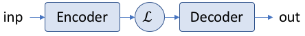
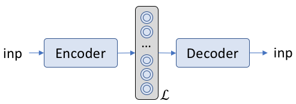
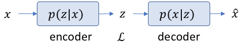
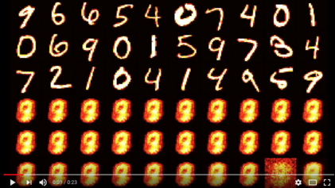
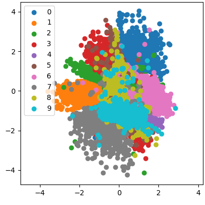
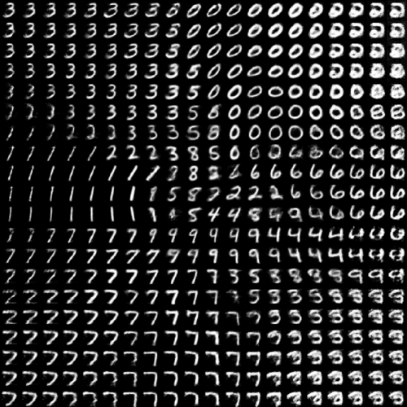

# Variational Autoencoders

Variational Autoencoders (VAE) are the fundamental blocks for most modern AI systems. These include: 

- [Font Generation](https://kaonashi-tyc.github.io/2017/04/06/zi2zi.html)
- [Anime character generation](https://arxiv.org/pdf/1708.05509.pdf)
- [text to images](https://arxiv.org/pdf/1703.06412.pdf)
- [3d object generation](https://www.youtube.com/watch?v=HO1LYJb818Q)
- [image editing](https://arxiv.org/abs/1611.06355)
- [face ageing](https://arxiv.org/pdf/1702.01983.pdf)
- [pose estimation](https://arxiv.org/pdf/1705.09368.pdf)
- [style transfer](https://www.youtube.com/watch?v=JzgOfISLNjk)

Only to name a few. The above is not an exhaustive list by any means, and new applications are being created every day. This really appears to be the new frontier for data science in general, and finally we are approaching a direction in which true intuition about the world may be gleaned by machines. I am really excited about the future of AI. 

In this article, we shall explore the variational model that forms the basis of these generative models.

## 1. Encoder-Decoder Frameworks

Encoders and decoders have been used in the past for many applications. In cryptography for example, an encoder will encode an secret message into a cryptic counterpart, and a decoder will convert it back to the original message. In communications, an encoder (a microphone coupled to a radio transmission signal) will convert voice into FM radio waves, and a decoder (i.e. your radio) will convert it back to sound. JPEG and MPEG encoders encode pictures and movies into a lossy compression format, that can be decoded back to something resembling the original picture and movie. 

Neural network's also have such architectures wherein input information is converted into a latent space, and a decoder uses this information to convert the latent space into desired output. A simple architecture looks like the following:


 
Here \\( \mathcal{L} \\)  represents the latent space, and both the encoder and the decoder represent some form of neural network architecture (whether it be simple dense networks, or CNNs or RNNs, or something even more complicated).

Examples of the inp,  \\( \mathcal{L} \\), out are shown below:

| application| inp |  \\( \mathcal{L} \\) | out |
|--------------|-----|------------------------|------|
|  chatbot     | question | language model | answer
| translation | sentence in language 1 | language model | sentence in language 2 
| nucleus identification | image of cells | model for cells in an image | location of the nucleus 

## 2. Autoencoders

Autoencoders are simply the same as the encoder-detector frameworks, wherein, the input and outputs are the same. i.e. the network tries to predict itself. What is the use of something that tries to predict itself? The goal is not to find itself. It is to find a good latent space \\( \mathcal{L} \\).

For example, when a good language model is available, it can be used for a variety of purposes related to language tasks.

## 3. Variational Autoencoders

In variational autoencoders, the latent space \\( \mathcal{L} \\) is probabilistic in nature. It it typically represented in the form below:



As can be seen, the latent space has *two* concentric circles instead of the typical one that represents a node in a neural network. This represents that this quantity is a probability density function rather than a single number. During the forward pass, *a value is sampled* from within the probability distribution. However, in this scheme, there is a problem during the backward pass. 

How do we differentiate the weights w.r.t. the error when the weights are probabilistic?

For this, we need to see the encoder-decoder in a different light. We need to involve Bayesian inference in the auto encoder formalism. 



Now the input has a probability of getting a value. The latent space is the probability of obtaining some vector \\(z\\) given the input \\(x\\), and the decoder does the opposite. If we know \\(z\\), finding the decoder is typically very easy. It's a normal neural network. How about the encoder?  In terms of Bayes equation

$$ p(z|x) = \frac {p(x|z) p(z)} {p(x)} $$

This encoder equation is typically really difficult to solve, mainly because \\(p(x)\\) is a marginalized function that is nearly impossible to solve in most real-life scenarios. Some approximate this marginalization numerically using MCMC techniques. The other approach is to circumvent the problem entirely by approximating \\(p(z|x)\\) by a new function \\(q(z)\\) (actually \\(q(z|x)\\), but we shall drop the extra term for the purpose of simplifying some of the equations). So, let us redefine the problem. Find \\( q(z) \\) such that 

$$  q(z) \approx p(z|x) $$

## 4. An Aside on the K-L Divergence

The [K-L divergence](https://en.wikipedia.org/wiki/Kullback–Leibler_divergence) simply finds the difference between two different probability distributions. Let us take, for example, the set of values \\(\mathbf x = [\mathbf x_0, \mathbf x_1 \ldots \mathbf x_{N-1}]\\). Then, the probability distributions \\(p (\mathbf x)\\) and \\(q(\mathbf x)\\) represent two different probability distribution functions. A property of interest of these distributions are the average information content (or, as Shanon termed it, the information entropies) of each:

$$H_p(\mathbf x) =  - \Sigma_{\mathbf x} p(\mathbf x)  \log({p(\mathbf x)}) = - \mathbb E_p \log({p(\mathbf x)}) $$

Note that the \\(\mathbb E_p\\) represents the expectation operator. For a continuous variable, just change summation to the integral. We have specifically mentioned that the entropy is w.r.t. the distribution \\(p\\).

The question is whether the two distributions \\(p\\) and \\(q\\) are similar to each other. One way of finding similarities is to see whether their entropies are close. A simplified form of doing that is the following:

$$ - \mathbb E_p \log({p(\mathbf x)}) -  ( - \mathbb E_q \log({q(\mathbf x)})) $$

Now, the K-L divergence simply puts more emphasis on one of the probabilities more than the others (notice the change in the subscript of  \\(\mathbb E\\) for the second case).

$$ KL (p || q) = - \mathbb E_p \log({p(\mathbf x)}) -  ( - \mathbb E_p \log({q(\mathbf x)}))  $$

Thanks to the linearity of expectation operator:

$$ KL (p || q) = - \mathbb E_p \log  \Bigg ({ \frac {p(\mathbf x)} {q(\mathbf x)}} \Bigg  )   $$

which is the typical way in which the equation is written.

### 4.1. K-L divergence between two Gaussians

As it turns out, when the two distributions we are trying to map are gaussians, the K-L divergence has a particularly simple [form](https://stats.stackexchange.com/questions/7440/kl-divergence-between-two-univariate-gaussians):

$$ KL( \mathcal N(\mu_1, \sigma_1) || \mathcal N(\mu_2, \sigma_2) ) = \log(  \frac {\sigma_2} {\sigma_1} ) + \frac {\sigma_1^2 + (\mu_1 - \mu_2)^2} {2 \sigma_2^2} - \frac 1 2$$ .

More importantly, if one is a standard normal, the result looks like:

$$ KL( \mathcal N(\mu_1, \sigma_1) || \mathcal N(0, 1) ) = \frac 1 2  [ \sigma_1^2 + mu_1^2 -1 - \log( \sigma_1^2 )  ] $$ .


## 5. The K-L Divergence View

Now that we know that the K-L divergence is a sort of a distance measure, we can simply find a suitable function for \\(q(z)\\) that will approximate \\(p(z|x)\\) using the K-L divergence. Stated in another way, our objective becomes:

$$  \min  \Big[  KL( q(z) || p(z|x) )  \Big] = \min  \Big[  - \sum q(z) \log \Big(  \frac {p(z|x)} {q(z)}   \Big) \Big] $$

A little math will allow us to write the equation for the K-L divergence in the following manner:

$$  \log[p(x)] = KL( q(z) || p(z|x) )  +  \sum q(z) \log \Big(  \frac {p(x, z)} {q(z)} \Big) $$

Now, the LHS is constant. On the RHS, we are trying to minimize the first part of the equation. Which is the same thing as trying the maximize the second part of the RHS. This part is called the variational lower bound. This variational lower bound (after some math) is rewritten in the form:

$$ \mathbb E_{q(z)} \big[  \log( p(x|z) ) \big] - KL(  q(z) || p(z) )  $$

The first part of this equation \\(E_{q(z)} \big[  \log( p(x|z) ) \big]\\) is the point-wise difference. The second part is an approximation and acts like a regularization term in normal machine learning applications. 

## 5.1. The Gaussian Approximation

Here, we make some simplifying assumptions. We assume that both \\(p\\) and \\(q\\) may be approximated by Gaussian distributions. In fact, we shall assume that \\(p(z)\\) approximates to a standard normal function. This results in the second part of the equation becoming equivalent to the final equation in Section 4.1.

$$ \mathbb E_{q(z)} \big[  \log( p(x|z) ) \big] - KL(  q(z) || p(z) ) = || x -   x' ||^2  - \frac 1 2  [ \sigma_1^2 + mu_1^2 -1 - \log( \sigma_1^2 )  ]$$

## 6. The program 

The entire code is present in Github [here](https://github.com/Holmusk/NLP). A simplified version is described here:

We start with s set of input points:

```python
self.Inp  = tf.placeholder(
                dtype=tf.float32, 
                shape=(None, nInp))
```

The encoder is simply a set of dense layers. 

```python
self.encoder = None
for i, (l, a) in enumerate(zip(layers, activations)):
    if i == 0:
        self.encoder = tf.layers.dense(self.Inp, l, activation=a)
    else:
        self.encoder = tf.layers.dense(self.encoder, l, activation=a)
```

From the encoder, a latent state is generated in the form if mu and sigma:

```python
self.mu    = tf.layers.dense(self.encoder, nLatent, activation=None)
self.sigma = tf.layers.dense(self.encoder, nLatent, activation=tf.nn.sigmoid)

```

The decoder us generated by sampling from a set of independent standard normal distributions:

```python
self.Latent = tf.placeholder( dtype=tf.float32, shape=(None, nLatent))
self.decoder = self.Latent * self.sigma + self.mu 
for i, (l, a) in enumerate(zip(
                reversed(layers), reversed(activations))):
    self.decoder = tf.layers.dense(self.decoder, l, activation=a)

self.decoder = tf.layers.dense(self.decoder, nInp, activation=tf.nn.sigmoid)
```

Finally, the reconstruction error, and the K-L divergence is generated, and the total error is simply the sum of the two errors ...

```python
# ----- Reconstruction Error ----------------
self.aeErr = self.Inp * tf.log( self.decoder ) + (1-self.Inp) * tf.log( 1 - self.decoder )
self.aeErr = tf.reduce_sum( self.aeErr, 1)
self.aeErr = tf.reduce_mean( -1*self.aeErr )

# ----- KL Divergence-------------------------
self.KLErr = tf.reduce_sum( self.sigma**2 + self.mu**2 - 1 - tf.log( self.sigma**2 ), 1)
self.KLErr = tf.reduce_mean( self.KLErr * 0.5 )

# ----- Total Error-------------------------
self.Err   = (self.aeErr + self.L * self.KLErr)
```

## 7. First Results

Like everyone else, I have used the MNIST characters, and a 2D latent space. In the table below, we see a short movie of the training process. The characters in the upper half are the original images, while the characters in the lower half are the learned images. The latent space representation is shown in the second column. It is amazing how well the entire set of 10 characters is encoded within the two numbers. We also see a fairly good separation in the different numbers. 

learning process | latent space representation
---------|---------
[](https://www.youtube.com/watch?v=a8O2qWav_C4)     | 

## 8. The Generative Network

Once the latent space has been generated, once can sample from this space to obtain a set of new characters. For this, the generator is decoupled, and results obtained by providing values directly to `self.mu`. When a grid of points within the latent space is chosen, the generated characters look like that shown below.



Notice the correspondence between the location of the different characters in the generated space, and the points in the latent space. Keep an eye out for the repo. Hopefully, I'll keep it updated with different types if autoencoders in the future. 
